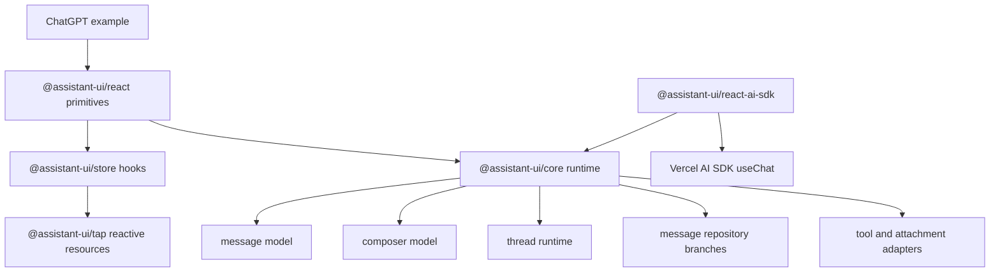
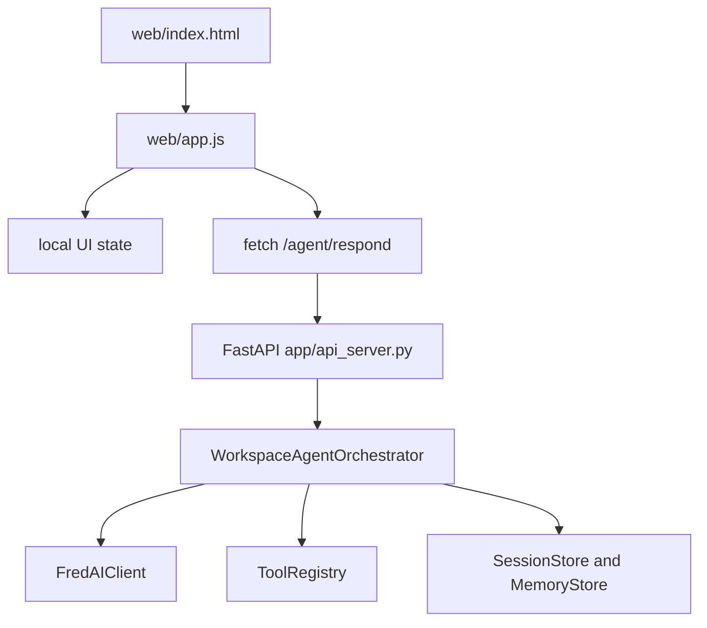

# assistant-ui ChatGPT UI Research And From-Scratch Build Plan

Date: 2026-06-27

This document is a handoff for rebuilding a ChatGPT-style UI from scratch for the Workspace FredAI Agent. The research source is the cloned `assistant-ui/assistant-ui` repository under `assistant-ui-research/`, especially `apps/docs/components/examples/chatgpt.tsx`, plus the local FredAI agent project in this workspace.

The goal is not to import `@assistant-ui/react` or copy assistant-ui source files into this project. The goal is to understand its architecture deeply enough to rebuild the parts we need using plain browser APIs, or a very small React-only layer if the work environment allows it.

## Executive Summary

assistant-ui does include a full ChatGPT-style example, but that example is not a single standalone implementation. It is a styled composition over a large package stack:

- `apps/docs/components/examples/chatgpt.tsx` defines the visible ChatGPT-like layout.
- `packages/react/src/primitives/*` defines the React primitives used by the example.
- `packages/store/src/*` bridges assistant-ui's reactive state into React hooks.
- `packages/core/src/*` owns the runtime, message model, composer model, branches, attachments, tool calls, and run lifecycle.
- `packages/react-ai-sdk/src/*` adapts Vercel AI SDK messages and streams into assistant-ui's runtime.
- `packages/ui/src/components/assistant-ui/thread.tsx` is a separate styled shadcn-style thread kit built on the same primitives.

For the Workspace FredAI Agent, the best path is to rebuild the ChatGPT UI as a small local UI on top of the existing `/agent/respond` FastAPI endpoint first. Add streaming, cancellation, branches, attachments, and tool rendering later only when needed.

The current project already has a no-package browser UI:

- `web/index.html`
- `web/app.js`
- `web/styles.css`
- `app/api_server.py`

That is the right place to build a package-light ChatGPT-style interface.

## Primary assistant-ui Source Chain

Start here:

1. `assistant-ui-research/apps/docs/components/examples/chatgpt.tsx`
   - The ChatGPT clone example.
   - Uses `ThreadPrimitive`, `ComposerPrimitive`, `MessagePrimitive`, `ActionBarPrimitive`, `BranchPickerPrimitive`, `AttachmentPrimitive`, `AuiIf`, `useAui`, and `useAuiState`.

2. `assistant-ui-research/packages/react/src/index.ts`
   - Public `@assistant-ui/react` export surface.
   - Re-exports primitives, store hooks, runtime providers, and core types.

3. `assistant-ui-research/packages/react/src/primitives/thread/*`
   - Thread root, viewport, messages, footer, scroll-to-bottom, suggestions.

4. `assistant-ui-research/packages/react/src/primitives/composer/*`
   - Composer form, input, send, cancel, add attachment, attachments, dictation, quote, queue.

5. `assistant-ui-research/packages/react/src/primitives/message/*`
   - Message root, parts rendering, grouped parts, attachments, error, quote, generative UI.

6. `assistant-ui-research/packages/react/src/primitives/actionBar/*`
   - Copy, edit, reload, feedback, speak, export markdown, more menu.

7. `assistant-ui-research/packages/react/src/primitives/branchPicker/*`
   - Previous/next branch controls and branch counter.

8. `assistant-ui-research/packages/store/src/*`
   - `useAuiState`, `useAui`, `AuiProvider`, `AuiIf`.
   - This is the React subscription layer over assistant-ui's internal reactive resources.

9. `assistant-ui-research/packages/core/src/types/message.ts`
   - Main message and message-part types.

10. `assistant-ui-research/packages/core/src/types/attachment.ts`
    - Attachment model.

11. `assistant-ui-research/packages/core/src/runtimes/local/local-thread-runtime-core.ts`
    - Local runtime send, run, cancel, tool-loop, and history logic.

12. `assistant-ui-research/packages/core/src/runtime/utils/message-repository.ts`
    - Branching conversation tree.

13. `assistant-ui-research/packages/react-ai-sdk/src/ui/use-chat/useChatRuntime.ts`
    - Adapter from Vercel `useChat` to assistant-ui runtime.

14. `assistant-ui-research/packages/react-ai-sdk/src/ui/use-chat/useAISDKRuntime.ts`
    - Converts AI SDK state changes into assistant-ui runtime actions.

15. `assistant-ui-research/packages/react-ai-sdk/src/ui/utils/convertMessage.ts`
    - Converts AI SDK message parts into assistant-ui message parts.

16. `assistant-ui-research/packages/ui/src/components/assistant-ui/thread.tsx`
    - Alternative styled default thread component. Useful as another example, not something to copy.

## What The ChatGPT Example Actually Builds

`chatgpt.tsx` is a visual shell. Its important pieces are:

- `ChatGPT`
  - Root thread container.
  - Shows `EmptyState` when `thread.isEmpty`.
  - Shows scrollable viewport, message list, sticky footer, composer, and disclaimer when non-empty.

- `EmptyState`
  - Centered welcome text.
  - Same composer shell as the active chat view.

- `Composer`
  - Rounded ChatGPT-style input shell.
  - Attachment button.
  - Attachment preview row.
  - Textarea input.
  - Primary action button.

- `ComposerPrimaryAction`
  - Four mutually exclusive states:
    - running: stop/cancel
    - dictating: stop dictation
    - has text: send
    - empty: dictate plus voice-mode button

- `UserMessage`
  - Right-aligned high-contrast bubble.
  - Attachment rendering.
  - Hover action bar with copy and edit.
  - Branch picker.

- `EditComposer`
  - Replaces a user message while editing.
  - Has cancel and send/update controls.

- `AssistantMessage`
  - Renders message parts.
  - Text parts use markdown.
  - Tool-call parts use tool UI if registered, otherwise a fallback.
  - Has assistant action bar: copy, feedback, speak, share, regenerate, more/export.
  - Has branch picker.

- `BranchPicker`
  - Previous button.
  - Current branch number and branch count.
  - Next button.

- `ChatGPTAttachmentUI`
  - Uses attachment state.
  - Shows image thumbnails for image attachments.
  - Shows file icon/name for non-images.
  - Allows removal in composer context.

The file is mostly layout and styling. It depends on assistant-ui for state, message iteration, actions, and runtime behavior.

## assistant-ui Architecture In Plain English



The important design idea is separation:

- Components are headless primitives with no hardcoded design.
- State is read through selectors such as `s.thread.isRunning` or `s.composer.isEmpty`.
- Actions are methods such as `composer.send()`, `composer.cancel()`, `message.reload()`, `message.switchToBranch()`.
- Runtime adapters connect those actions to a real backend.

For our project, this can be much simpler:



## Core Data Model To Rebuild

assistant-ui's full model is broad. For FredAI, start with a small subset.

### Minimal Thread State

Use this conceptually:

```ts
type ChatState = {
  workspaceId: string;
  userId: string;
  sessionId: string | null;
  messages: ChatMessage[];
  composerText: string;
  attachments: ChatAttachment[];
  isRunning: boolean;
  lastRequestId: string | null;
  error: string | null;
};
```

### Minimal Message

```ts
type ChatMessage = {
  id: string;
  role: "user" | "assistant" | "system";
  createdAt: string;
  status: "pending" | "running" | "complete" | "error" | "cancelled";
  parts: ChatPart[];
  meta?: {
    requestId?: string;
    durationMs?: number;
    toolNames?: string[];
    progressMessages?: string[];
  };
};
```

### Minimal Message Part

```ts
type ChatPart =
  | { type: "text"; text: string }
  | { type: "tool"; name: string; input?: unknown; result?: unknown; status: string }
  | { type: "attachment"; attachmentId: string };
```

### Minimal Attachment

```ts
type ChatAttachment = {
  id: string;
  name: string;
  type: "image" | "file";
  contentType: string;
  file?: File;
  previewUrl?: string;
  status: "pending" | "complete" | "error";
};
```

### What To Skip In MVP

Do not implement these first:

- Branch tree.
- Tool approval UI.
- MCP apps.
- Generative UI parts.
- Voice input.
- Speech output.
- Cloud thread list.
- AI SDK adapters.
- Radix popovers/menus/tooltips.

These are useful later, but they are the source of much of assistant-ui's complexity and dependency graph.

## Send Lifecycle In assistant-ui

assistant-ui's local runtime flow is:

1. User types in composer.
2. Composer form submits.
3. `composer.send()` converts composer state into an `AppendMessage`.
4. Runtime appends the user message to the message repository.
5. Runtime creates an empty assistant message with status `running`.
6. Runtime calls `ChatModelAdapter.run({ messages, runConfig, abortSignal, context })`.
7. If the adapter streams, each update merges into the assistant message.
8. If the result requires tool calls, runtime executes or waits for tool results.
9. Runtime loops until no more tool continuation is needed.
10. Assistant message becomes `complete`, `incomplete`, or `requires-action`.

For FredAI MVP:

1. User types in `#messageInput`.
2. Submit handler appends a user bubble.
3. UI appends a pending assistant bubble.
4. `fetch("/agent/respond", body)` sends `{ workspace_id, user_id, session_id, message, attachments }`.
5. Replace pending assistant bubble with `data.answer`.
6. Store `data.session_id`, `data.request_id`, `data.tool_names`, `data.duration_ms`, `data.progress_messages`, and `data.status`.

This is already close to the current `web/app.js`; it needs a more ChatGPT-like render layer and richer state, not a new package stack.

## Current FredAI Backend Contract

`app/api_server.py` exposes:

- `GET /`
  - Serves `web/index.html`.

- `GET /health`
  - Returns server status, model name, FredAI base URL, scheduler state, and memory debug data.

- `POST /agent/respond`
  - Request:
    - `workspace_id`
    - `user_id`
    - `session_id`
    - `message`
    - `attachments`
  - Response:
    - `answer`
    - `request_id`
    - `session_id`
    - `tool_names`
    - `duration_ms`
    - `status`
    - `progress_messages`
    - optional `error`

- `GET /agent/sessions`
  - Lists sessions.

- `GET /agent/traces/{request_id}`
  - Returns trace events.

The UI should treat `/agent/respond` as the first transport. Streaming can be added later with a new endpoint, for example `/agent/respond-stream`.

## From-Scratch UI Components To Build

Build these local components as functions in `web/app.js` first. No npm packages required.

### 1. App Shell

Responsibilities:

- Left sidebar with workspace, user, session, new session, copy session, model, tool count, last request.
- Main chat surface.
- Top optional status line.
- Bottom composer.

### 2. Thread Viewport

Responsibilities:

- Render empty state if there are no messages.
- Render all messages in order.
- Track whether user is near bottom.
- Auto-scroll only if user has not scrolled upward.
- Show scroll-to-bottom button when not at bottom.

Scratch behavior:

- Maintain `isAtBottom`.
- On scroll, set `isAtBottom = nearBottom(messagesEl)`.
- After message append, if `isAtBottom` was true before append, scroll to bottom.
- On "scroll to bottom" button, force scroll.

### 3. Message Renderer

Responsibilities:

- Route by `role`.
- User message: right bubble.
- Assistant message: left/full-width text.
- Error state: red or warning style.
- Metadata row: request id, duration, tools, trace link.

Scratch behavior:

- Use `document.createElement`, not string HTML, for safety.
- Use `textContent` for untrusted text.
- Add a minimal markdown renderer later only if allowed and safe.

### 4. Composer

Responsibilities:

- Multiline input.
- Enter to send, Shift+Enter for newline. Current UI uses Ctrl/Cmd+Enter; ChatGPT uses Enter to send.
- Send button when text exists.
- Stop button while running if cancellation exists.
- Attachment button.

Scratch behavior:

- Use a `<textarea>`.
- Auto-grow with local JS by setting height to `auto` then `scrollHeight`.
- Disable send when empty or running.
- Add `AbortController` only after backend streaming/cancel exists.

### 5. Action Bar

Responsibilities:

- Copy text.
- Edit user message.
- Regenerate assistant response.
- Open trace.
- Optional feedback buttons.

Scratch behavior:

- Copy: `navigator.clipboard.writeText(messageText)`.
- Edit: put user text back into composer and remove messages after that turn, or call a backend edit endpoint later.
- Regenerate: re-send the last user message using the same session id.

### 6. Attachments

Responsibilities:

- Select files.
- Preview image thumbnails.
- Show file chips.
- Send attachment metadata.

MVP options:

- If backend does not yet process binary uploads, keep attachments disabled or send only metadata.
- If backend accepts base64 content, convert small files with `FileReader`.
- For work documents, prefer backend file-path tools over browser upload if the files live on a shared drive.

### 7. Tool And Progress Display

Current backend returns `tool_names` and `progress_messages`. That is enough for a lightweight tool display:

- Show used tools under the assistant answer.
- Show progress messages in a collapsible details block.
- Link trace to `/agent/traces/{request_id}`.

Do not build assistant-ui's full tool-call message-part renderer until the backend exposes structured tool calls.

## CSS And Visual Requirements

For ChatGPT-like behavior:

- Main background: white in light mode, near black in dark mode.
- Conversation max width around `44rem` to `48rem`.
- User bubble aligned right with max width around `70%`.
- Assistant messages align left but usually do not need a bubble.
- Composer is sticky at bottom and centered to conversation width.
- Empty state centers a short greeting above the composer.
- Buttons are square/circular icon buttons where possible.
- Action bars should not shift message layout when appearing.
- Long content must wrap.
- The composer must not overlap messages on small screens.

Since this project currently has no icon package, use text symbols or inline SVG icons that we write ourselves. Do not add lucide, radix, or assistant-ui packages unless the company explicitly allows them.

## Dependency Audit

assistant-ui is not a good direct dependency for the work environment if package access is blocked. Important package weight:

- `@assistant-ui/react`
  - Depends on `@assistant-ui/core`, `@assistant-ui/store`, `@assistant-ui/tap`, Radix packages, `assistant-cloud`, `assistant-stream`, `nanoid`, `react-textarea-autosize`, `safe-content-frame`, `zod`, `zustand`, and others.

- `@assistant-ui/ui`
  - Private styled kit.
  - Depends on many UI packages such as Radix, class helpers, command menu, date picker, resizable panels, charts, markdown/syntax packages, and more.

- `@assistant-ui/react-ai-sdk`
  - Depends on Vercel AI SDK and converts AI SDK message formats into assistant-ui message formats.

For FredAI, avoid all of this at first. Use:

- Existing FastAPI backend.
- Existing static files served from `/static`.
- Plain JavaScript.
- Plain CSS.
- Browser `fetch`, `AbortController`, `FileReader`, `URL.createObjectURL`, and `navigator.clipboard`.

## Recommended Implementation Phases

### Phase 1: ChatGPT-Like Non-Streaming UI

Use the existing `/agent/respond` endpoint.

Deliver:

- ChatGPT-style empty state.
- Sticky bottom composer.
- User and assistant message rendering.
- Copy, trace link, new session, copy session.
- Tool names and progress display.
- Better scroll behavior.
- Auto-grow textarea.

Files:

- `web/index.html`
- `web/app.js`
- `web/styles.css`

Backend changes: none.

### Phase 2: Client-Side Conversation State Cleanup

Deliver:

- One `state.messages` array.
- One `render()` function.
- Message IDs.
- Pending assistant placeholder.
- Error messages as normal assistant messages with `status: "error"`.
- Edit/regenerate basics.

Backend changes: optional session history endpoint if reload history is needed.

### Phase 3: Streaming Endpoint

Add server-sent events or fetch streaming.

Suggested endpoint:

- `POST /agent/respond-stream`

Suggested events:

- `start`: request id and session id
- `progress`: progress text
- `delta`: assistant text delta
- `tool`: tool event
- `final`: metadata and status
- `error`: error details

UI behavior:

- Assistant bubble appears immediately.
- Text updates incrementally.
- Stop button calls `AbortController.abort()`.
- Backend should observe disconnect or abort and stop work where possible.

### Phase 4: Attachments

Deliver:

- File picker.
- Image preview.
- File chips.
- Remove attachment.
- Send content only after backend contract is decided.

Backend options:

- Base64 in JSON for small files.
- Multipart upload endpoint.
- Shared-drive path references.

### Phase 5: Structured Tool Rendering

Deliver:

- Tool call cards from structured trace/progress data.
- Collapsible progress timeline.
- Approval prompts if a future tool needs human confirmation.

Backend changes:

- Return structured tool events, not only tool names.

### Phase 6: Branches

Deliver only if users need regenerate alternatives.

assistant-ui uses a message tree:

- Every message has a parent.
- Alternative regenerated messages are siblings.
- The visible conversation is the selected path from root to current head.

Scratch simplification:

- Store alternatives only on assistant messages:
  - `message.alternatives = [{ parts, meta }]`
  - `message.activeAlternativeIndex`
- Add previous/next buttons when alternatives length is greater than 1.

## Minimal File-Level Build Plan For This Project

### `web/index.html`

Keep it simple:

- Keep sidebar fields.
- Replace current message area with:
  - `#emptyState`
  - `#messages`
  - `#scrollToBottomButton`
- Replace composer footer with:
  - attachment button
  - textarea
  - send/stop button
  - small status text

### `web/app.js`

Refactor toward these modules or sections:

- `state`
- `dom`
- `actions`
- `transport`
- `render`
- `renderMessage`
- `renderComposer`
- `scrollManager`
- `attachments`

Important actions:

- `sendMessage()`
- `newSession()`
- `copySession()`
- `copyMessage(messageId)`
- `editMessage(messageId)`
- `regenerateFrom(messageId)`
- `addAttachments(files)`
- `removeAttachment(attachmentId)`

### `web/styles.css`

Use local CSS only:

- `.shell`
- `.sidebar`
- `.chat`
- `.thread`
- `.empty-state`
- `.messages`
- `.message`
- `.message.user`
- `.message.assistant`
- `.message-actions`
- `.composer`
- `.composer-shell`
- `.composer-input`
- `.icon-button`
- `.attachment-list`
- `.attachment-chip`
- `.tool-summary`

### `app/api_server.py`

No change for Phase 1.

Future:

- Add `/agent/respond-stream`.
- Add `/agent/session/{id}/messages` if the UI should reload old sessions.
- Add file upload endpoint if attachments need binary upload.

## What Not To Copy

Do not copy these directly into the FredAI project:

- `apps/docs/components/examples/chatgpt.tsx`
- `packages/react/src/primitives/*`
- `packages/core/src/*`
- `packages/store/src/*`
- `packages/tap/src/*`
- `packages/ui/src/*`

Use them as design references only. The source code is built for a reusable open-source library. The FredAI project needs a smaller purpose-built UI.

## Key Lessons To Reuse

Use these ideas:

- Selector-based thinking: UI should read small state slices, not query the DOM for everything.
- Message parts: represent assistant answers as parts, not just raw strings, so tools/attachments can be added later.
- Composer state is separate from message state.
- Runtime state should distinguish `running`, `complete`, `error`, and `cancelled`.
- Auto-scroll should respect user scrolling.
- Action bars should be tied to message state.
- Attachments need pending and complete states.
- Branches are a tree concept, but they can wait.

## Practical Recommendation

Build the FredAI ChatGPT UI from the current static frontend, not from assistant-ui packages.

The first good version should be:

- No npm install.
- No React required.
- No assistant-ui imports.
- No Radix, Zustand, Tailwind, lucide, AI SDK, or markdown package.
- Fully served by existing FastAPI static hosting.
- Compatible with a locked-down work computer.

After Phase 1 is stable, decide whether React is available internally. If React is allowed, port the same state model to small React components. If React is not allowed, the vanilla implementation can still support most ChatGPT UI behavior.

## External References

- assistant-ui website: https://www.assistant-ui.com/
- ChatGPT example source: https://github.com/assistant-ui/assistant-ui/blob/main/apps/docs/components/examples/chatgpt.tsx
- assistant-ui repository: https://github.com/assistant-ui/assistant-ui
