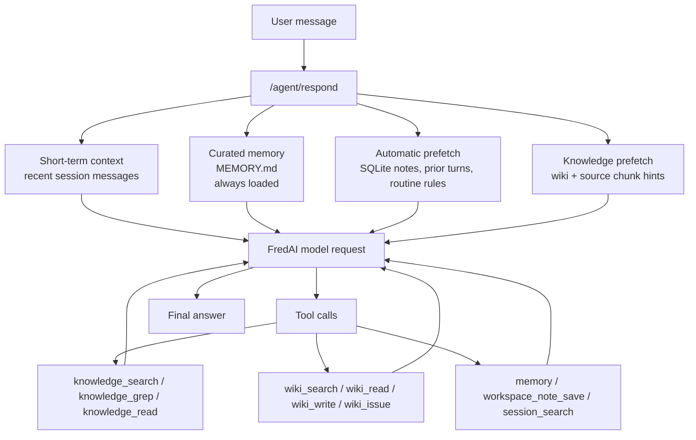

# Curated Memory Guide

This guide explains how curated memory works in the current single-file design.

## Short Answer

The CRT Analytics Agent has one curated Markdown memory file:

```text
.runtime/memories/MEMORY.md
```

`MEMORY.md` is loaded into the agent's system instructions on every request. It is always-on memory, not searchable memory. Keep it short, stable, and policy-like.

Do not put raw EVA guides, methodology documents, model review documents, PRM files, chat logs, extracted attachments, or long process notes in `MEMORY.md`. Put source documents in the knowledge base, put interpretation/correction pages in the wiki layer, and put ad hoc workspace facts in SQLite workspace notes.

## Memory Layers



## What MEMORY.md Should Contain

Use `MEMORY.md` for rules that should influence every turn:

- Agent identity and mission.
- Retrieval discipline.
- Correction policy.
- Source-of-truth policy.
- Stable implementation constraints, such as using FredAI as the only model gateway.

Current recommended content:

```text
CRT Analytics Agent identity: this agent is an expert on the execution, methodology, workflow, and PRM created for CRT Analytics, including EVA, Dynamic CRT Cost, and Spot CRT Cost. It uses FredAI as the only model gateway.
---ENTRY---
Memory policy: MEMORY.md is the only curated always-on Markdown memory. Use it for stable agent operating rules, retrieval policy, and compact correction policy. Do not place raw source documents, long process details, chat logs, or extracted attachments in MEMORY.md.
---ENTRY---
Retrieval policy: for CRT Analytics factual answers, first use wiki_search/wiki_read for curated interpretations and corrections, then use knowledge_search or knowledge_grep followed by knowledge_read for source-document evidence. Use workspace_note_search for durable workspace facts and session_search for older conversation details outside the recent context window.
---ENTRY---
Correction policy: keep raw uploaded source documents stable. If a user says an EVA, Dynamic CRT Cost, Spot CRT Cost, workflow, or PRM interpretation is wrong, record the disputed point with wiki_issue and update the relevant wiki page with wiki_write after verification. Treat wiki corrections as interpretation/supplement memory layered on top of immutable source documents.
```

## What Goes Elsewhere

| Information | Best Location | Why |
| --- | --- | --- |
| EVA user guide, methodology, model review, model use docs | Knowledge base source documents | Chunked, searchable, citable |
| "The guide is ambiguous here; use this interpretation" | Wiki page or wiki issue | Correction/supplement layer |
| One-off project note | `workspace_note_save` | Durable but not always in prompt |
| Old conversation detail | `session_search` | Searchable from SQLite history |
| User privacy/profile separation | Future user mode | Not represented by curated Markdown now |

## Correction Workflow

When the user says the agent's interpretation is wrong:

1. Keep the uploaded source document unchanged.
2. Use `wiki_issue` to record the disputed or missing interpretation.
3. Use `knowledge_search` or `knowledge_grep`, then `knowledge_read`, to verify the best source evidence.
4. Use `wiki_write` to update the relevant process/concept page with the corrected interpretation and chunk references.
5. Test from a new thread. If the new thread finds the correction through `wiki_search`/`wiki_read`, the correction is durable.

## How To Edit MEMORY.md

Manual edit:

```powershell
notepad .runtime\memories\MEMORY.md
```

Agent/tool edit:

Ask the agent to save a stable operating rule as curated memory. The `memory` tool now has only one target:

```json
{
  "action": "add",
  "target": "memory",
  "content": "For CRT Analytics factual answers, prefer source-backed citations before final recommendations."
}
```

## Practical Rule

If the information must always shape the agent's behavior, put a short rule in `MEMORY.md`.

If the information should be found only when relevant, put it in the knowledge base, wiki, workspace notes, or session history.
