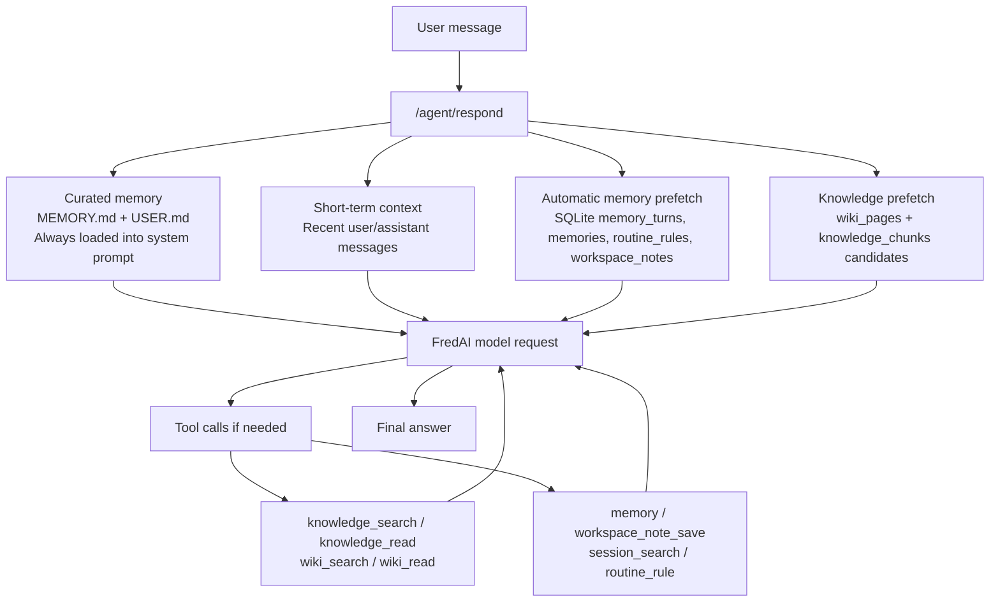

# Curated Memory Guide

This guide explains what the curated memory Markdown files do in the CRT Analytics Agent, how they differ from short-term chat history and the knowledge base, and how to draft/update them safely.

## Short Answer

Curated memory is the agent's small, always-on memory.

In this project, curated memory lives in:

```text
.runtime/memories/MEMORY.md
.runtime/memories/USER.md
```

Those two files are loaded into the system instructions on every request. That means curated memory is not searched only when relevant. It is always shown to FredAI before the model answers.

Because of that, curated memory should be short, stable, and policy-like. It should not contain full documents, raw chat logs, large process notes, or detailed EVA methodology text. Those belong in the knowledge base or SQLite workspace notes.

## Where It Sits In The Memory System

The current system has several memory layers:



### 1. Short-Term Context

Source:

- Recent messages in the current thread/session.

Code behavior:

- The server sends recent `user` and `assistant` messages directly to FredAI.
- Default limit is `WORKSPACE_AGENT_SESSION_CONTEXT_MESSAGES=16`.

Use it for:

- The current conversation.
- Clarifications made a few turns ago.
- Uploaded attachment context in the current working thread.

Do not rely on it for:

- Knowledge that must survive new sessions.
- Governance facts.
- Stable EVA process documentation.

### 2. Curated Memory

Source:

- `.runtime/memories/MEMORY.md`
- `.runtime/memories/USER.md`

Code behavior:

- `CuratedMemoryStore` loads the files.
- `WorkspaceAgentOrchestrator._build_instructions()` reloads curated memory every request.
- The content is inserted into the system instructions as:

```text
Curated persistent memory loaded at session start:
MEMORY [...]
...
USER PROFILE [...]
...
```

Use it for:

- Stable operating rules.
- Persistent agent identity.
- Retrieval policy.
- High-level project mission.
- User communication preferences.
- Small, durable reminders that should influence every turn.

Do not use it for:

- EVA user guide content.
- Full methodology documentation.
- Long lists of fields or metrics.
- Step-by-step runbooks.
- Raw LAN paths, unless they are tiny and always relevant.
- Secrets, tokens, passwords, client IDs, or credentials.

### 3. Local SQLite Long-Term Memory

Source:

- `.runtime/state.sqlite3`
- Tables include `memories`, `memory_turns`, `routine_rules`, and `workspace_notes`.

Code behavior:

- Successful user/assistant turns are recorded into `memory_turns`.
- Automatic memory prefetch searches:
  - `memories`
  - `memory_turns`
  - matching `routine_rules`
  - `workspace_notes`
- The prefetch result is injected into the latest user message inside a `<memory-context>` block.

Use it for:

- Durable notes that are useful but not always needed.
- Past conversation recall.
- Standing routines or hooks.
- Workspace facts too large or too specific for curated memory.

### 4. Knowledge Base And Wiki

Source:

- `.runtime/state.sqlite3`
- Tables include:
  - `knowledge_bases`
  - `knowledge_documents`
  - `knowledge_chunks`
  - `knowledge_chunks_fts`
  - `wiki_pages`
  - `wiki_page_revisions`
  - `wiki_issues`

Code behavior:

- Source documents are ingested with `knowledge_ingest`.
- Documents are split into parent/child chunks.
- Retrieval uses `knowledge_search`, `knowledge_grep`, and `knowledge_read`.
- Curated synthesis pages use `wiki_search`, `wiki_read`, `wiki_write`, and `wiki_issue`.

Use it for:

- EVA user guides.
- EVA methodology documents.
- MACS documentation.
- Model review documents.
- Model use documents.
- Model register documents.
- Source-backed process knowledge that needs citations.

## Why Curated Memory Exists

Curated memory exists because some facts should guide every answer even before retrieval starts.

Examples:

- "Use FredAI as the only model gateway."
- "For factual EVA answers, retrieve source evidence before answering."
- "Do not put large documents in curated memory."
- "The user's project is the CRT Analytics Agent, initially focused on EVA and MACS."

These are not normal facts to search for. They are operating posture.

Think of curated memory as the agent's constitution and working identity, not its library.

## Current Default Curated Memory

The project seeds `MEMORY.md` with entries like:

```text
Workspace FredAI Agent identity: this agent serves an internal workspace API, keeps durable session and memory context, and uses FredAI as the only model gateway.
---ENTRY---
Memory policy: MEMORY.md is for stable agent operating rules and retrieval policy. USER.md is for stable user preferences and profile facts. Raw logs, large documents, repeated task data, and bulky notes belong in SQLite workspace notes or conversation history.
---ENTRY---
Retrieval policy: use curated memory as always-on guidance, automatic prefetch as temporary turn context, workspace_note_search for durable workspace facts, and session_search for older conversation details outside the recent context window.
```

The project seeds `USER.md` with:

```text
No confirmed user profile has been provided yet. Save stable preferences, language choice, communication style, and workspace-specific profile facts here with the memory tool.
```

Entries are separated by:

```text
---ENTRY---
```

## Drafting Rules

### Good Curated Memory Entries

Good entries are:

- Stable for weeks or months.
- Short enough to read every turn.
- Actionable.
- Cross-session.
- More like policy than a note.

Good examples:

```text
CRT Analytics Agent mission: help users understand, validate, and eventually execute CRT Analytics processes, starting with EVA and then connected processes such as MACS.
```

```text
For EVA/MACS factual answers, prefer source-backed retrieval: check curated wiki pages first for process overviews, then use knowledge_search or knowledge_grep and knowledge_read before citing documentation.
```

```text
When a user corrects EVA process knowledge, do not rely only on the current chat. Use wiki_issue for disputed knowledge and wiki_write or knowledge_ingest for durable correction records.
```

```text
Keep answers practical for Freddie Mac Multifamily CRT Analytics users: explain what to do, where to check, and what source supports it.
```

### Bad Curated Memory Entries

Bad entries are too large, too specific, volatile, or source-like:

```text
The full EVA EUC User Guide says: [20 pages pasted here...]
```

```text
Yesterday Jeremy uploaded file X and asked question Y.
```

```text
The current MACS output path is definitely ...
```

```text
CLIENT_SECRET=...
```

Why these are bad:

- Full documents belong in `knowledge_documents` and `knowledge_chunks`.
- Conversation history is already stored in sessions and `memory_turns`.
- Operational paths may change and should be source-backed.
- Secrets should never be stored in memory files.

## MEMORY.md Versus USER.md

Use `MEMORY.md` for agent/project rules:

- Agent identity.
- Retrieval policy.
- Tool-use policy.
- Project mission.
- Safety rules.
- General workspace behavior.

Use `USER.md` for stable user preferences/profile:

- Preferred explanation style.
- Preferred language.
- The user's role or recurring work context.
- How the user wants handoffs structured.

Examples for `USER.md`:

```text
User prefers concrete, step-by-step work-computer instructions with exact PowerShell commands when setting up or debugging the agent.
```

```text
User is building the CRT Analytics Agent for work and wants low-dependency, workplace-compatible implementation choices.
```

Do not put private HR information, credentials, or highly sensitive personal details in `USER.md`.

## How To Update Curated Memory Right Now

There are two safe ways.

### Option A: Ask The Agent To Use The `memory` Tool

In the UI, say something like:

```text
Save this as curated agent memory: CRT Analytics Agent mission is to help users understand, validate, and eventually execute CRT Analytics processes, starting with EVA and connected processes such as MACS. Put it in MEMORY.md.
```

Or:

```text
Save this as user memory: I prefer exact work-computer setup commands and concise explanations of why each command is needed.
```

Expected behavior:

- FredAI should call the `memory` tool.
- The tool writes to `.runtime/memories/MEMORY.md` or `.runtime/memories/USER.md`.
- The response should confirm the memory tool result.

Check with:

```powershell
Get-Content .runtime\memories\MEMORY.md
Get-Content .runtime\memories\USER.md
```

### Option B: Edit The Files Manually

Open:

```text
.runtime/memories/MEMORY.md
.runtime/memories/USER.md
```

Add one entry at a time. Separate entries with:

```text
---ENTRY---
```

Then restart the server or simply send another request. The orchestrator reloads curated memory every request.

Manual editing is useful when you want tight control. The tool is useful when you want the agent to maintain memory from conversation.

## Recommended Initial MEMORY.md For CRT Analytics

This is a good starting point for the work computer after EVA document ingestion:

```text
CRT Analytics Agent mission: help users understand, validate, and eventually execute CRT Analytics processes, starting with EVA and connected processes such as MACS.
---ENTRY---
Use FredAI as the only model gateway. Do not call OpenAI, Anthropic, or other model APIs directly from this project.
---ENTRY---
For EVA/MACS factual answers, prefer source-backed retrieval: check curated wiki pages first for process overviews, then use knowledge_search or knowledge_grep and knowledge_read before citing documentation.
---ENTRY---
Curated memory is for stable always-on rules only. Store EVA guides, methodology documents, model review documents, runbooks, and long process details in the knowledge base, not in MEMORY.md.
---ENTRY---
When a user reports wrong or stale process knowledge, create or update a wiki_issue and then update source-backed wiki or knowledge records. Do not treat a correction as durable merely because it appears in recent chat.
---ENTRY---
When helping with EVA execution tools, prefer small auditable step tools with dry-run behavior, explicit inputs, artifact paths, and readable error summaries.
```

Keep this short. If it starts growing beyond a few compact entries, move details into `workspace_note_save`, wiki pages, or knowledge documents.

## Recommended Initial USER.md

For your current development style:

```text
User prefers concrete, comprehensive work-computer instructions with exact commands, expected outputs, and plain explanations of what each step proves.
---ENTRY---
User is building the CRT Analytics Agent for workplace use and prefers low-dependency implementation choices because many packages may be blocked on the work computer.
---ENTRY---
User wants implementation handoffs to include file names changed, how to copy updates to the work computer, how to test, and how to diagnose failures.
```

Only add these if you are comfortable having them influence every turn.

## Decision Table

Use this table when deciding where a fact belongs:

| Information type | Where it should go | Why |
| --- | --- | --- |
| Current thread details | Short-term session context | Already sent directly for recent turns |
| Old conversation detail | `session_search` / session history | Searchable when needed |
| Always-on agent rule | `MEMORY.md` | Should influence every turn |
| Stable user preference | `USER.md` | Should influence every turn |
| Bulky workspace note | `workspace_note_save` | Searchable, not always-on |
| Future behavior/hook/tool request | `routine_rule` | Structured routine storage |
| EVA/MACS source document | `knowledge_ingest` | Chunked, searchable, citable |
| Synthesized process overview | `wiki_write` | Curated cross-document wiki |
| Disputed/outdated process fact | `wiki_issue` | Auditable correction workflow |
| Secret/token/password | Nowhere in memory | Keep secrets in environment/config only |

## How Curated Memory Interacts With Knowledge Retrieval

Curated memory should not contain the answer to every EVA question. Instead, it should instruct the agent how to find the answer.

Good pattern:

```text
For EVA factual answers, retrieve source evidence before answering.
```

Then, when asked:

```text
What are the inputs for EVA?
```

The agent should:

1. See curated memory telling it to retrieve source evidence.
2. Use `wiki_search` if an EVA wiki exists.
3. Use `knowledge_search` or `knowledge_grep`.
4. Use `knowledge_read` on the best chunks.
5. Answer with citations.

Bad pattern:

```text
MEMORY.md contains a manually typed list of all EVA inputs.
```

That becomes stale and hard to audit. Put the source document in the knowledge base and keep curated memory focused on retrieval behavior.

## How To Verify Curated Memory Is Loaded

Send any request, then inspect the trace:

```powershell
Invoke-RestMethod "http://127.0.0.1:8000/agent/traces/REQ_ID_HERE" | ConvertTo-Json -Depth 30
```

Look for the `instructions` event. It should include:

```text
Curated persistent memory loaded at session start:
MEMORY [...]
...
USER PROFILE [...]
...
```

You can also check health:

```powershell
Invoke-RestMethod "http://127.0.0.1:8000/health" | ConvertTo-Json -Depth 10
```

Look for:

```text
memory.memory_dir
memory.providers
memory.tools
```

## How To Verify An Update Works

1. Add or replace an entry through the `memory` tool or by editing the file.
2. Start a new thread.
3. Ask a question where the memory should matter.
4. Inspect `/agent/traces/{request_id}`.
5. Confirm the `instructions` event includes the new entry.
6. Confirm the model behavior changed.

Example:

Add:

```text
For EVA factual answers, retrieve source evidence before answering.
```

Test in a new thread:

```text
What are the EVA input files?
```

Pass criteria:

- Trace shows the curated memory entry in `instructions`.
- The model calls knowledge/wiki tools.
- The final answer cites source context.

## Maintenance Rules

Review curated memory weekly while the project is evolving.

Remove entries when:

- They duplicate another entry.
- They are no longer stable.
- They are source facts that now belong in the knowledge base.
- They cause the model to over-trigger tools.

Keep entries:

- Short.
- Specific.
- Action-oriented.
- Easy to audit.

## Practical Rule Of Thumb

If the agent should remember it every single turn, put a compact version in curated memory.

If the agent should find it only when relevant, put it in searchable memory or the knowledge base.

If the agent should cite it, put it in the knowledge base or wiki with source references.

If the agent should never expose it, do not put it in memory.
